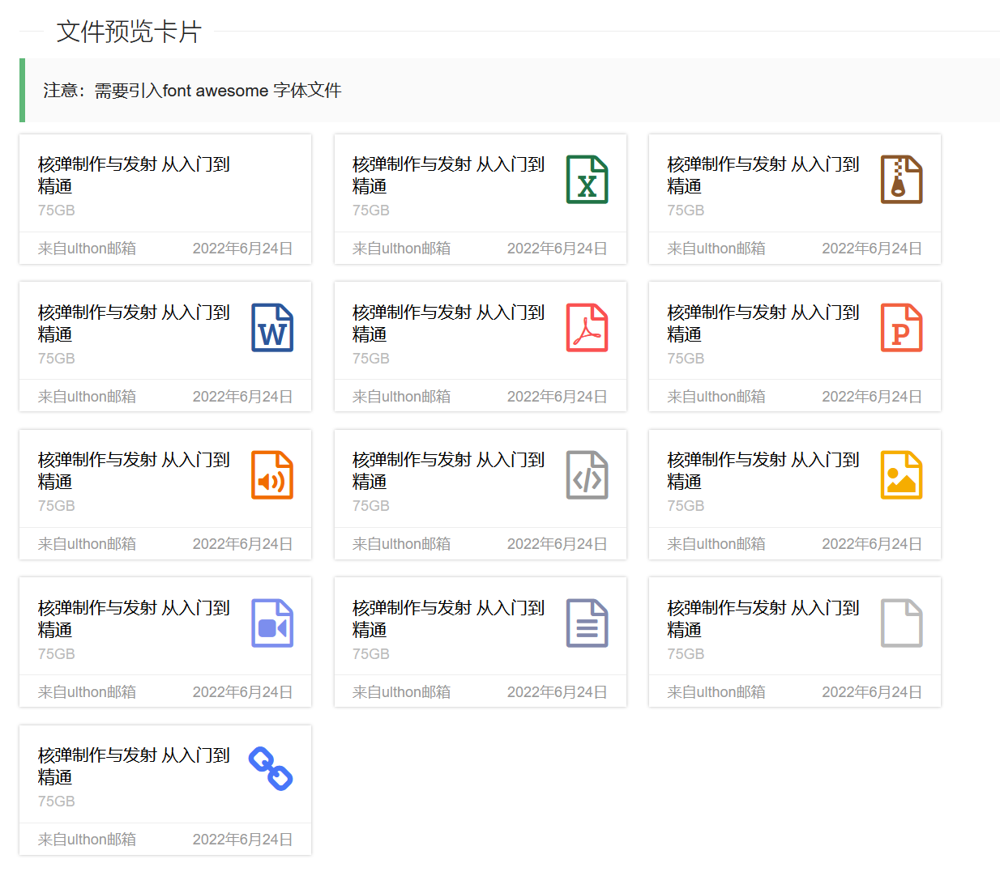
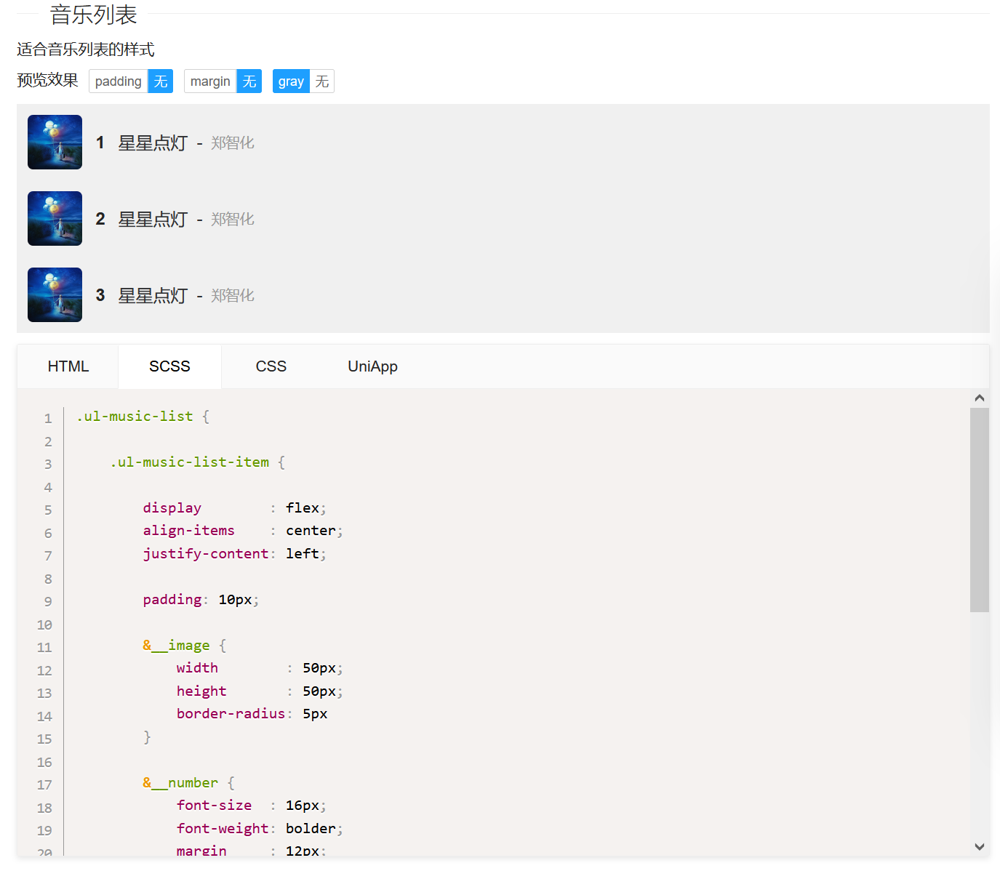

# ULUI

### 介绍
ULUI 是一个基于纯 CSS 和 HTML 的轻量级样式库。它不依赖任何前端框架，可以轻松集成到任何 Web 项目中，提供一套简洁、一致的 UI 组件和视觉风格。


### 主要用处

- 实现原始的样式组件库(而不是vue/angular之类的组件主题)
- 收藏主流的JS插件
- 不限制开发终端,只要支持css的都可以使用(vue,angular,uni,小程序都可以)

### 使用说明

只需要引入文件即可:
```
//ului.top/cdn/ului.css

比如:
<link rel="stylesheet" href="//ului.top/cdn/ului.css">
```

全部文档网站 http://ului.top/

### 整体设计原则

- **简约现代风格**：保持简洁、清晰的视觉层次
- **卡片化设计**：大部分组件采用卡片容器，提供良好的内容分组
- **一致的间距系统**：使用统一的padding/margin规范
- **柔和的圆角**：4-8px的圆角，营造友好感
- **微妙的阴影**：轻量级阴影增强层次感

### 部分组件展示




### 收藏组件


### 开发说明

本站是一个基于ulthon_admin的官网项目,有关样式的代码在`source/scss`目录下.

关于样式组件,目前开始使用`scss`重构开发.

推荐使用vscode开发,安装`Live Sass Compiler`扩展并启用以下配置:
在项目目录下创建配置文件`.vscode/settings.json`;
```
{
    "liveSassCompile.settings.formats": [
        {
            "format": "compressed",
            "extensionName": ".min.css",
            "savePath": "/public/cdn/"
        },
        {
            "format": "expanded",
            "extensionName": ".css",
            "savePath": "/public/cdn/"
        },
    ],
    "liveSassCompile.settings.generateMap": false
}
```

### SCSS 结构说明

项目的 SCSS 遵循模块化的组织方式，核心文件结构如下：

-   `source/scss/ului.scss`: 这是样式的主入口文件。它负责按顺序导入所有其他 SCSS 文件，最终编译成 `ului.css`。

-   `source/scss/_common.scss`: 定义了项目的全局样式、变量（如颜色、字体、间距）、混合宏（Mixins）和基础重置样式。所有通用样式都应在此文件中定义。

-   `source/components/_index.scss`: 这是一个**自动生成**的文件，它会引入所有位于 `source/components/` 目录下的独立组件样式。当你使用 `php think make:component` 命令创建新组件时，该文件会自动更新以包含新组件的 SCSS。
-  

基本的目录结构。

```
source                              
├─ components                                       
└─ scss                             
   ├─ basic                                   
   ├─ layout                                   
   ├─ reset                                    
   ├─ state                                   
   ├─ utility                              
   ├─ ului.scss                                   
```

### 组件命名规范

为了保持代码的清晰和可维护性，所有组件都应遵循以下命名规范：

-   **组件根 Class**: 必须采用 `ul-{type}-{name}` 的格式。
    -   `ul-`: 所有组件的固定前缀，作为命名空间。
    -   `{type}`: 组件的分类，例如 `card`, `list`, `form`, `btn` 等。
    -   `{name}`: 组件的具体名称。推荐使用有意义的单词（如 `user-info`, `file`）。如果组件变体较多或难以找到合适的描述词，也**允许使用数字序号**（如 `1`, `2`, `3`）。
    -   **示例**: `.ul-card-user`, `.ul-list-item`, `.ul-card-1`。

-   **内部元素 (BEM 规范)**: 组件内部的子元素命名应严格遵循 **BEM (Block, Element, Modifier)** 方法论，以确保样式的独立性和可维护性。
    -   **块 (Block)**: 即组件的根 Class，如 `.ul-info-card`。
    -   **元素 (Element)**: 块的组成部分，使用双下划线 `__` 连接。例如：`.ul-info-card__header`, `.ul-info-card__body`。
    -   **修饰符 (Modifier)**: 用于定义块或元素的外观或状态。我们不使用 BEM 的 `--` 连接符，而是采用**独立的通用状态类**进行组合。例如：
        -   深色主题卡片: `.ul-info-card.dark`
        -   禁用状态操作: `.ul-info-card__action.disabled`

-   **工具/辅助 Class**: 通用的辅助类也应以 `ul-` 开头，例如 `.ul-inline-block`。

### 样式类型

ULUI 的样式库体系结构清晰，主要包含以下几种类型，由底层到上层依次为：

-   **基础与重置 (Base & Reset)**: 负责统一和重置不同浏览器的默认样式，并定义全局变量（如颜色、字体、间距）、基础排版和链接样式。这是整个样式库的基石。
-   **布局组件 (Layout)**: 提供页面级的宏观布局能力，如栅格系统 (`.ul-row`, `.ul-col-*`)、容器 (`.ul-container`) 等，用于快速搭建响应式页面框架。
-   **业务组件 (Business Component)**: 为特定业务场景设计的、功能完整的组件，例如用户信息卡片 (`.ul-card-user`)、文件列表 (`.ul-card-file`) 等。它们是组件库的核心价值所在。一个业务组件**可能**由多个基础组件组合而成，也**可能**因为其设计的独特性而成为一个完全独立的、自成一体的样式实现。
-   **状态类 (State)**: 用于描述组件或元素在特定情境下的状态，例如激活 (`.active`)、禁用 (`.disabled`)、隐藏 (`.hidden`) 或不同的主题模式 (`.dark`)。
-   **工具/辅助类 (Utility)**: 提供原子化的、高复用性的 CSS 功能，用于微调样式。例如间距、浮动、文本对齐等。


### 组件开发规范

所有新贡献或修改的组件都应遵循以下基本规范：

1.  **命名规范**：组件的 HTML 和 SCSS 必须严格遵循 说明文件中 的组件命名规范，确保样式的独立性和可维护性。
2.  **样式变量**：优先使用 `_common.scss` 中定义的全局变量（如颜色、字体、间距），避免在组件样式中使用硬编码的数值。
3.  **示例内容**：HTML 示例代码应使用通用、有代表性的占位内容，清晰地展示组件的结构和用途。
4.  **响应式设计**：组件应具备良好的响应式能力，确保在桌面和移动设备上都能正常显示和使用。


#### 运行站点

本站是基于ulthon_admin开发的,它是ThinkPHP6的项目,你需要掌握相关基础才行.实际上是一个CMS站点.

> 如果你只希望修改组件样式的话,只关注`source/scss`目录下的文件就可以了

```
git clone https://gitee.com/ulthon/ului.git

cd ului

composer install

php think migrate:run

php think seed:run

php think run

```
此时可以访问:127.0.0.1:8000


### 参与贡献

1.  在issue提交你想要的样式截图,过段时间没准就有了

### 创建组件命令

新版本的组件支持独立的文件，更好的浏览体验，可以快捷单独复制每个文件，可以通过命令生成：

```
php think make:component tpl_name component_name component_title 
```

比如:

```
php think make:component list ul-user-list 用户列表
```



新的组件代码结构：
```
ul-music-list   
├─ _index.env   
├─ _index.html  
├─ _index.md    
└─ _index.scss  
```